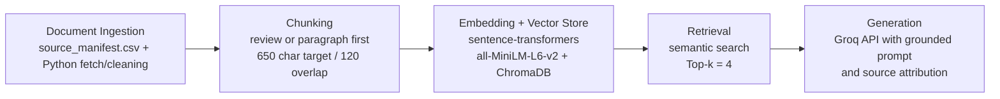

# Project 1 Planning: The Unofficial Guide

> Write this document before you write any pipeline code.
> Your spec and architecture diagram are what you'll use to direct AI tools (Claude, Copilot, etc.) to generate your implementation — the more specific they are, the more useful the generated code will be.
> Update the Retrieval Approach and Chunking Strategy sections if you change your approach during implementation.
> Update this file before starting any stretch features.

---

## Domain

<!-- What domain did you choose? Why is this knowledge valuable and hard to find through official channels? -->

This unofficial guide focuses on Georgia Tech OMSCS course-selection and workload advice, especially the first-year decisions students make about which classes to take, how hard they really are, and what background they assume. That knowledge is valuable because the official OMSCS pages explain course goals and prerequisites, but they do not capture week-to-week workload, how forgiving a course is for newcomers, whether group projects go smoothly, or which classes students consistently describe as good entry points. Student reviews and planning threads contain that tacit knowledge, but it is scattered across review feeds and Reddit discussions instead of living in one searchable place.

---

## Documents

<!-- List your specific sources: URLs, subreddit names, forum threads, or file descriptions.
     Aim for at least 10 sources that together cover different subtopics or perspectives within your domain. -->

| # | Source | Description | URL or location |
|---|--------|-------------|-----------------|
| 1 | OMSCS Machine Learning specialization page | Official specialization requirements and elective context for course planning | https://omscs.gatech.edu/specialization-machine-learning |
| 2 | r/OMSCS Specializations and Courses Megathread | Student planning thread about specialization choices, sequencing, and registration tradeoffs | https://www.reddit.com/r/OMSCS/comments/1pyef5z/course_specs_megathread_selection_choices/ |
| 3 | CS 6515: Intro to Graduate Algorithms | Official overview and expected background for GA | https://omscs.gatech.edu/cs-6515-intro-graduate-algorithms |
| 4 | OMSCentral: Introduction to Graduate Algorithms reviews | Student reviews with ratings, workload numbers, and free-text advice | https://www.omscentral.com/courses/introduction-to-graduate-algorithms/reviews |
| 5 | CS 7641: Machine Learning | Official overview and prerequisites for ML | https://omscs.gatech.edu/cs-7641-machine-learning |
| 6 | OMSCentral: Machine Learning reviews | Student reviews about ML workload, math intensity, and project difficulty | https://www.omscentral.com/courses/machine-learning/reviews |
| 7 | CS 6300: Software Development Process | Official overview for a common first-course option | https://omscs.gatech.edu/cs-6300-software-development-process |
| 8 | OMSCentral: Software Development Process reviews | Student reviews about beginner friendliness and practical value | https://www.omscentral.com/courses/software-development-process/reviews |
| 9 | CS 6310: Software Architecture and Design | Official overview for SAD | https://omscs.gatech.edu/cs-6310-software-architecture-and-design |
| 10 | OMSCentral: Software Architecture and Design reviews | Student reviews about group work, lecture quality, and deliverables | https://www.omscentral.com/courses/software-architecture-and-design/reviews |
| 11 | CS 6603: AI, Ethics, and Society | Official overview for AI Ethics | https://omscs.gatech.edu/cs-6603-ai-ethics-and-society |
| 12 | OMSCentral: AI, Ethics, and Society reviews | Student reviews about workload, usefulness, and course depth | https://www.omscentral.com/courses/ai-ethics-and-society/reviews |

---

## Chunking Strategy

<!-- How will you split documents into chunks?
     State your chunk size (in tokens or characters), overlap size, and explain why those
     numbers fit the structure of your documents.
     A review-heavy corpus warrants different chunking than a long FAQ. -->

**Chunk size:** 650 characters target per chunk

**Overlap:** 120 characters when a segment must be split; no overlap when a single review or paragraph already fits in one chunk

**Reasoning:** This corpus mixes very short student reviews with shorter official course pages and one longer Reddit planning thread, so I do not want a one-size-fits-all splitter that ignores document structure. I plan to split on natural boundaries first: individual review entries for OMSCentral, paragraphs or bullet sections for official OMSCS pages, and paragraph-level comments for Reddit. If any single unit is longer than 650 characters, I will fall back to a sliding window with 120 characters of overlap so details like "the projects are useful but the group work is frustrating" do not get cut across boundaries. A smaller chunk size would risk separating workload comments from the course name or context, while a much larger chunk size would blur together multiple opinions from different reviewers and hurt retrieval precision.

---

## Retrieval Approach

<!-- Which embedding model are you using (e.g., all-MiniLM-L6-v2 via sentence-transformers)?
     How many chunks will you retrieve per query (top-k)?
     If you were deploying this for real users and cost wasn't a constraint, what tradeoffs
     would you weigh in choosing a different embedding model — context length, multilingual
     support, accuracy on domain-specific text, latency? -->

**Embedding model:** `all-MiniLM-L6-v2` via `sentence-transformers`

**Top-k:** 4

**Production tradeoff reflection:** I am choosing `all-MiniLM-L6-v2` because it is fast, local, and strong enough for a small course-advice corpus where the main job is matching conceptually similar phrases like "good first class," "manageable workload," or "math heavy" even when the exact wording changes. Retrieving the top 4 chunks should give the generator enough evidence from both official and student sources without flooding the prompt with repetitive or contradictory reviews. If cost were not a constraint in a production system, I would compare this local model against a larger embedding model with stronger nuance on opinion-heavy text, because student reviews often use slang, abbreviations, and indirect judgments instead of formal descriptions. I would weigh that gain in retrieval accuracy against latency, hosting cost, privacy of student-written text, and whether a larger model handled longer Reddit-style discussion chunks better.

---

## Evaluation Plan

<!-- List your 5 test questions with their expected correct answers.
     Questions should be specific enough that you can judge whether the system's response
     is right or wrong. "What are good dining halls?" is too vague.
     "What do students say about wait times at [dining hall name] during lunch?" is testable. -->

| # | Question | Expected answer |
|---|----------|-----------------|
| 1 | What background does CS 6515 expect before a student takes it? | The official page should mention strong undergraduate algorithms foundations, including asymptotic analysis, graph algorithms, dynamic programming, and divide-and-conquer; if that background is weak, students should refresh before enrolling. |
| 2 | What do students say makes CS 7641 Machine Learning difficult in practice? | Reviews should describe it as math-heavy and time-intensive, with demanding projects and ambiguity around open-ended assignments; students often say the difficulty is not just coding but understanding the concepts well enough to tune experiments. |
| 3 | Is CS 6300 Software Development Process a good first OMSCS course? | The likely grounded answer is yes for many students, especially those newer to software engineering or online graduate study, but experienced developers may find parts of it basic. |
| 4 | What risk shows up repeatedly in student feedback for CS 6310 Software Architecture and Design? | Reviews should surface concerns about uneven group-project experiences and mixed opinions on how current or valuable the course materials feel. |
| 5 | How is CS 6603 AI, Ethics, and Society positioned compared with the other courses in this set? | The official page should frame it around responsible AI and ethical reasoning, while student reviews are likely to describe it as lighter-weight and more reading/discussion focused than technically intensive classes like GA or ML. |

---

## Anticipated Challenges

<!-- What could go wrong? Name at least two specific risks with reasoning.
     Consider: noisy or inconsistent documents, missing source attribution, off-topic
     retrieval, chunks that split key information across boundaries. -->

1. Mixed writing styles could pull retrieval in the wrong direction. Official OMSCS pages use formal catalog language, while students use abbreviations like GA, ML, SDP, and SAD plus subjective phrases like "good starter" or "sneaky workload." A query about "best first course" might accidentally retrieve only official descriptions unless chunk metadata and the grounding prompt keep student-review evidence visible.

2. Review pages are noisy and sometimes contradictory. One student may call a course manageable while another calls it overwhelming, and the useful claim may only appear in one sentence inside a larger review. If chunks are too large, multiple opinions will be blended together; if they are too small, retrieval may return a sentiment without enough context to know whether it refers to workload, grading, group projects, or prerequisites.

---

## Architecture

<!-- Draw a diagram of your pipeline showing the five stages:
     Document Ingestion → Chunking → Embedding + Vector Store → Retrieval → Generation
     Label each stage with the tool or library you're using.
     You can use ASCII art, a Mermaid diagram, or embed a sketch as an image.
     You'll use this diagram as context when prompting AI tools to implement each stage. -->

## AI Tool Plan

<!-- For each part of the pipeline below, describe:
     - Which AI tool you plan to use (Claude, Copilot, ChatGPT, etc.)
     - What you'll give it as input (which sections of this planning.md, which requirements)
     - What you expect it to produce
     - How you'll verify the output matches your spec

     "I'll use AI to help me code" is not a plan.
     "I'll give Claude my Chunking Strategy section and ask it to implement chunk_text()
     with my specified chunk size and overlap" is a plan. -->

**Milestone 3 — Ingestion and chunking:** I will give Codex my Domain, Documents, and Chunking Strategy sections plus `documents/source_manifest.csv`, then ask it to implement the ingestion script that loads each source, extracts plain text, and splits it into chunks with source metadata. I expect it to produce chunking code and a reproducible output format such as JSON records with `source`, `url`, `chunk_id`, and `text`. I will verify the result by manually inspecting sample chunks from one official page, one OMSCentral review page, and the Reddit thread to confirm that each chunk preserves a complete thought and includes enough source information for citation later.

**Milestone 4 — Embedding and retrieval:** I will give Codex my Retrieval Approach section and ask it to implement an indexing script using `all-MiniLM-L6-v2` and ChromaDB, plus a retrieval function that returns the top 4 most relevant chunks with similarity scores and source labels. I expect code that builds the vector store, persists it locally, and supports repeatable search queries. I will verify it by running my five evaluation questions and checking whether the retrieved chunks mention the correct course and the right aspect of that course, such as prerequisites, workload, or group-project risk.

**Milestone 5 — Generation and interface:** I will give Codex my Retrieval Approach and Evaluation Plan sections and ask it to implement a grounded answer-generation function and a simple interface, most likely CLI first and optionally Gradio if time allows. I expect it to produce a Groq-backed response step that answers only from the retrieved chunks and formats citations clearly. I will verify the output by checking that answers cite the retrieved sources, stay within the evidence, and admit uncertainty when the retrieved context does not support a stronger claim.
