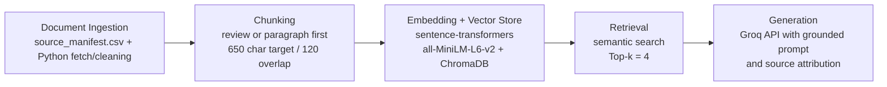

# Project 1 Planning: The Unofficial Guide

> Write this document before you write any pipeline code.
> Your spec and architecture diagram are what you'll use to direct AI tools (Claude, Copilot, etc.) to generate your implementation — the more specific they are, the more useful the generated code will be.
> Update the Retrieval Approach and Chunking Strategy sections if you change your approach during implementation.
> Update this file before starting any stretch features.

---

## Domain

<!-- What domain did you choose? Why is this knowledge valuable and hard to find through official channels? -->

This unofficial guide is about Georgia Tech OMSCS course planning, especially the questions students usually have at the start of the program. The official course pages explain what a class covers, but they do not really tell you how heavy the workload feels, whether a course is beginner-friendly, how stressful the projects are, or what students wish they had known before enrolling. That kind of advice exists, but it is spread across review sites and Reddit threads instead of being easy to search in one place.

---

## Documents

<!-- List your specific sources: URLs, subreddit names, forum threads, or file descriptions.
     Aim for at least 10 sources that together cover different subtopics or perspectives within your domain. -->

| # | Source | Description | URL or location |
|---|--------|-------------|-----------------|
| 1 | OMSCS Machine Learning specialization page | Official specialization requirements and elective context for course planning | https://omscs.gatech.edu/specialization-machine-learning |
| 2 | r/OMSCS Specializations and Courses Megathread | Student planning thread about specialization choices, sequencing, and registration tradeoffs | https://www.reddit.com/r/OMSCS/comments/1pyef5z/course_specs_megathread_selection_choices/ |
| 3 | CS 6515: Intro to Graduate Algorithms | Official overview and expected background for GA | https://omscs.gatech.edu/cs-6515-intro-graduate-algorithms |
| 4 | OMSCentral: Introduction to Graduate Algorithms reviews | Student reviews with ratings, workload numbers, and free-text advice | https://www.omscentral.com/courses/introduction-to-graduate-algorithms/reviews |
| 5 | CS 7641: Machine Learning | Official overview and prerequisites for ML | https://omscs.gatech.edu/cs-7641-machine-learning |
| 6 | OMSCentral: Machine Learning reviews | Student reviews about ML workload, math intensity, and project difficulty | https://www.omscentral.com/courses/machine-learning/reviews |
| 7 | CS 6300: Software Development Process | Official overview for a common first-course option | https://omscs.gatech.edu/cs-6300-software-development-process |
| 8 | OMSCentral: Software Development Process reviews | Student reviews about beginner friendliness and practical value | https://www.omscentral.com/courses/software-development-process/reviews |
| 9 | CS 6310: Software Architecture and Design | Official overview for SAD | https://omscs.gatech.edu/cs-6310-software-architecture-and-design |
| 10 | OMSCentral: Software Architecture and Design reviews | Student reviews about group work, lecture quality, and deliverables | https://www.omscentral.com/courses/software-architecture-and-design/reviews |
| 11 | CS 6603: AI, Ethics, and Society | Official overview for AI Ethics | https://omscs.gatech.edu/cs-6603-ai-ethics-and-society |
| 12 | OMSCentral: AI, Ethics, and Society reviews | Student reviews about workload, usefulness, and course depth | https://www.omscentral.com/courses/ai-ethics-and-society/reviews |

---

## Chunking Strategy

<!-- How will you split documents into chunks?
     State your chunk size (in tokens or characters), overlap size, and explain why those
     numbers fit the structure of your documents.
     A review-heavy corpus warrants different chunking than a long FAQ. -->

**Chunk size:** 650 characters target per chunk

**Overlap:** 120 characters when a segment must be split; no overlap when a single review or paragraph already fits in one chunk

**Reasoning:** My sources are a mix of short student reviews, short official course pages, and one longer Reddit thread, so I do not want to split everything the exact same way. I plan to keep natural units when possible: one review at a time for OMSCentral, paragraph or bullet sections for official pages, and paragraph-level comments for Reddit. If a section is too long, I will split it with a 120-character overlap so important details are not cut in half. I chose 650 characters because it is large enough to keep a full thought together, but still small enough to avoid stuffing too many different opinions into one chunk.

---

## Retrieval Approach

<!-- Which embedding model are you using (e.g., all-MiniLM-L6-v2 via sentence-transformers)?
     How many chunks will you retrieve per query (top-k)?
     If you were deploying this for real users and cost wasn't a constraint, what tradeoffs
     would you weigh in choosing a different embedding model — context length, multilingual
     support, accuracy on domain-specific text, latency? -->

**Embedding model:** `all-MiniLM-L6-v2` via `sentence-transformers`

**Top-k:** 4

**Production tradeoff reflection:** I chose `all-MiniLM-L6-v2` because it is fast, local, and should work well for a small project like this. The main goal is to match ideas, not just exact words, so it should still connect phrases like "good first class" and "manageable workload" even if the wording is different. I picked top-4 retrieval because it should give the model enough evidence without overwhelming it with repeated or conflicting reviews. If I were building this for real users with a bigger budget, I would compare it against a stronger embedding model to see if it handled opinion-heavy student writing better, but I would also have to think about speed, cost, and privacy.

---

## Evaluation Plan

<!-- List your 5 test questions with their expected correct answers.
     Questions should be specific enough that you can judge whether the system's response
     is right or wrong. "What are good dining halls?" is too vague.
     "What do students say about wait times at [dining hall name] during lunch?" is testable. -->

| # | Question | Expected answer |
|---|----------|-----------------|
| 1 | What background does CS 6515 expect before a student takes it? | The official page should mention strong undergraduate algorithms foundations, including asymptotic analysis, graph algorithms, dynamic programming, and divide-and-conquer; if that background is weak, students should refresh before enrolling. |
| 2 | What do students say makes CS 7641 Machine Learning difficult in practice? | Reviews should describe it as math-heavy and time-intensive, with demanding projects and ambiguity around open-ended assignments; students often say the difficulty is not just coding but understanding the concepts well enough to tune experiments. |
| 3 | Is CS 6300 Software Development Process a good first OMSCS course? | The likely grounded answer is yes for many students, especially those newer to software engineering or online graduate study, but experienced developers may find parts of it basic. |
| 4 | What risk shows up repeatedly in student feedback for CS 6310 Software Architecture and Design? | Reviews should surface concerns about uneven group-project experiences and mixed opinions on how current or valuable the course materials feel. |
| 5 | How is CS 6603 AI, Ethics, and Society positioned compared with the other courses in this set? | The official page should frame it around responsible AI and ethical reasoning, while student reviews are likely to describe it as lighter-weight and more reading/discussion focused than technically intensive classes like GA or ML. |

---

## Anticipated Challenges

<!-- What could go wrong? Name at least two specific risks with reasoning.
     Consider: noisy or inconsistent documents, missing source attribution, off-topic
     retrieval, chunks that split key information across boundaries. -->

1. The sources do not all sound the same. Official OMSCS pages are formal, but student reviews use shorthand like GA, ML, SDP, and SAD and say things in a much more casual way. That could make retrieval miss the student perspective if the system leans too much on official language.

2. Student reviews can be messy and sometimes disagree with each other. One person might say a class is manageable while another says it is overwhelming. If my chunks are too big, those opinions get mixed together; if they are too small, I might retrieve a sentence without enough context to know what the student was actually talking about.

---

## Architecture

<!-- Draw a diagram of your pipeline showing the five stages:
     Document Ingestion → Chunking → Embedding + Vector Store → Retrieval → Generation
     Label each stage with the tool or library you're using.
     You can use ASCII art, a Mermaid diagram, or embed a sketch as an image.
     You'll use this diagram as context when prompting AI tools to implement each stage. -->

## AI Tool Plan

<!-- For each part of the pipeline below, describe:
     - Which AI tool you plan to use (Claude, Copilot, ChatGPT, etc.)
     - What you'll give it as input (which sections of this planning.md, which requirements)
     - What you expect it to produce
     - How you'll verify the output matches your spec

     "I'll use AI to help me code" is not a plan.
     "I'll give Claude my Chunking Strategy section and ask it to implement chunk_text()
     with my specified chunk size and overlap" is a plan. -->

**Milestone 3 — Ingestion and chunking:** I will give Codex my Domain, Documents, and Chunking Strategy sections plus `documents/source_manifest.csv`, then ask it to build the ingestion script. I want it to load each source, clean the text, and split it into chunks with metadata like source name, URL, and chunk ID. I will check the result by reading sample chunks from an official page, an OMSCentral review page, and the Reddit thread to make sure each chunk still feels readable and complete.

**Milestone 4 — Embedding and retrieval:** I will give Codex my Retrieval Approach section and ask it to build the indexing and search steps using `all-MiniLM-L6-v2` and ChromaDB. I want a retrieval function that returns the top 4 relevant chunks along with their source labels. I will test it with my five evaluation questions and check whether the retrieved results actually talk about the right course and the right issue, like workload, prerequisites, or group projects.

**Milestone 5 — Generation and interface:** I will give Codex my Retrieval Approach and Evaluation Plan sections and ask it to build a grounded answer step plus a simple interface, probably CLI first and maybe Gradio later if I have time. I want the model to answer only from the retrieved chunks and clearly show where the information came from. I will verify that by checking whether answers stay close to the sources, include citations, and avoid making claims that are not supported by the retrieved text.
